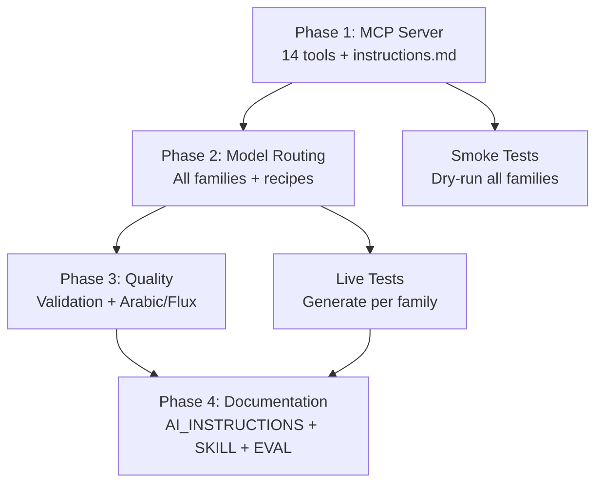

# Ultimate DreamForge — Comprehensive Improvement Plan

Transform DreamForge from a working CLI wrapper into the definitive AI agent image generation platform, with a rich MCP server, family-aware routing for every installed model, output management, and production-grade agent tooling.

## Background

### What We Have Today
- **CLI** (`dreamforge_cli_direct.py`): 468-line orchestrator with dry-run, batch JSONL, validation, brand-kit, creative briefs
- **MCP Server** (`dreamforge_mcp_server.py`): **Only 4 tools** — `generate_image`, `generate_arabic_poster`, `upscale_image`, `list_dreamforge_styles`
- **Agent Tools** (`dreamforge_agent_tools.py`): 15 use-case recipes, manifest system, fake-text heuristic
- **Inventory** (`dreamforge_cli_inventory.py`): Fast model/font scanning, family inference, dependency checks
- **Arabic Pipeline** (`arabic_poster_pipeline.py`): 3-phase compositing for exact Arabic text

### Installed Models (RTX 5060 Ti 16GB)
| Family | Models Available |
|--------|----------------|
| SDXL | juggernautXL_v8, RealVisXL_V5, epicrealismXL (Lightning + standard), NoobAI-XL, sd_xl_base, sd_xl_refiner, and 8 more |
| Flux | flux1-dev-fp8, flux1-schnell-fp8, svdq-fp4 variants |
| Flux Kontext | flux1-dev-kontext_fp8_scaled, svdq-fp4_r32-flux.1-kontext-dev |
| Flux 2 (Klein) | Flux2-Klein-9B-consistency-V2, flux-2-klein-4b-fp8, flux-2-klein-9b-kv-fp8 |
| HiDream O1 | hidream_o1_image_dev_mxfp8 |
| Qwen Image | qwen_image_fp8_e4m3fn |
| Qwen Image Edit | Qwen_Image_Edit-Q3_K_M.gguf, Q5_1.gguf, fp8 safetensors |
| Z-Image | z_image_turbo_bf16, z_image_turbo_fp8_e4m3fn |
| SD1.5 | majicmixRealistic_v7, v1-5-pruned, realisticVision |
| Hunyuan Video | hunyuanvideo1.5 (720p t2v, 720p i2v, 1080p SR) |

### Research Findings (Open-Design MCP Patterns)
The open-design MCP server exposes 7 tools with these key patterns worth adapting:
1. **Active Context** — tools default to "whatever is currently open," eliminating parameter boilerplate
2. **Bundle Fetching** (`get_artifact`) — pull everything about a design in one call
3. **Fuzzy Resolution** — accept name substrings, resolve server-side
4. **Cheap Polling** — `list_files(since=<unix-ms>)` for change detection
5. **Rich `instructions.md`** — tells agents when to use which tool and best practices

---

## User Review Required

> [!IMPORTANT]
> This plan is large (4 phases). I recommend we execute **Phase 1 (MCP)** and **Phase 2 (Model Routing)** together as the core upgrade, then **Phase 3 (Recipes)** and **Phase 4 (Docs)** as a follow-up.

> [!WARNING]
> **Qwen-Image-Edit** remains unstable — the "pig" CLIP encoder architecture is rejected, and the FP8 safetensors variant crashes during load (access violation). I'll add proper error handling and dependency preflight, but won't claim it's production-ready until a smoke test passes. Is that acceptable?

## Open Questions

> [!IMPORTANT]
> **Q1: Video models scope.** You have Hunyuan Video 1.5 and LTX-Video installed. Should the MCP expose video generation tools, or keep scope to images only for now?

> [!IMPORTANT]
> **Q2: Flux Kontext img2img.** Flux Kontext requires an input image for editing. Should I add a dedicated `edit_image` MCP tool (separate from `generate_image`), or fold it into the existing `generate_image` tool with an optional `input_image` parameter?

> [!IMPORTANT]
> **Q3: Output gallery persistence.** Should I add a lightweight SQLite index for outputs (searchable by prompt, model, date) or keep it file-system-only with manifest JSON scanning?

---

## Phase 1: MCP Server Overhaul (Priority: P0)

Expand from 4 tools to **14 tools**, inspired by open-design patterns.

### [MODIFY] [dreamforge_mcp_server.py](file:///d:/DreamForge/backend/dreamforge_mcp_server.py)

Complete rewrite. New tool inventory:

| # | Tool | Purpose | Inspired By |
|---|------|---------|-------------|
| 1 | `generate_image` | Text-to-image with full creative brief fields | Existing (enhanced) |
| 2 | `edit_image` | Image-to-image: Flux Kontext editing, inpaint, img2img | New |
| 3 | `generate_arabic_poster` | Arabic text compositing pipeline | Existing (enhanced) |
| 4 | `upscale_image` | Image upscaling | Existing |
| 5 | `dry_run` | Preview generation plan without GPU | New |
| 6 | `list_models` | Browse installed models with family/size/VRAM fitness | New |
| 7 | `resolve_model` | Fuzzy model name resolution with metadata | open-design fuzzy resolution |
| 8 | `recommend_model` | Get best model for a use-case + VRAM profile | New |
| 9 | `list_styles` | Available DreamForge style presets | Existing (improved) |
| 10 | `list_use_cases` | Available recipes with their default settings | New |
| 11 | `check_dependencies` | Preflight dependency check for a model | New |
| 12 | `validate_image` | Standalone image quality validation | New |
| 13 | `get_last_generation` | Active context — return last generation's full bundle | open-design `get_active_context` |
| 14 | `list_outputs` | Browse outputs with `since` timestamp filtering | open-design `list_files(since=)` |

#### Key Design Decisions

**Active Context Pattern:**
```python
# Server maintains last generation state
_last_generation = {
    "prompt": "...",
    "model": {...},
    "seed": 12345,
    "outputs": ["D:\\DreamForge\\outputs\\image.png"],
    "manifest": "D:\\DreamForge\\outputs\\image.generation_manifest.json",
    "timestamp": "2026-05-22T03:00:00"
}
```

**Enhanced `generate_image` signature:**
```python
@mcp.tool()
def generate_image(
    prompt: str,
    model: str = None,           # Fuzzy name — resolved server-side
    use_case: str = None,        # Recipe name (product_ad, cinematic, etc.)
    negative_prompt: str = "",
    aspect_ratio: str = "1024x1024",
    width: int = None,
    height: int = None,
    performance: str = "Speed",
    image_number: int = 1,
    styles: list[str] = None,
    seed: int = -1,
    steps: int = None,
    cfg_scale: float = None,
    vram_profile: str = "16gb",
    # Creative brief fields
    subject: str = None,
    composition: str = None,
    lighting: str = None,
    mood: str = None,
    camera: str = None,
    # Validation
    validate: bool = True,
    check_fake_text: bool = False,
    # Brand kit
    brand_kit: str = None,
    # Output
    output: str = None,
) -> str:
```

**New `edit_image` tool:**
```python
@mcp.tool()
def edit_image(
    input_image: str,            # Absolute path to source image
    prompt: str = "",            # Edit instruction or target description
    model: str = None,           # Auto-selects Flux Kontext or Qwen Edit
    edit_type: str = "auto",     # auto, kontext, inpaint, img2img, qwen_edit
    strength: float = 0.75,
    vram_profile: str = "16gb",
    output: str = None,
) -> str:
```

---

### [NEW] [dreamforge_mcp_instructions.md](file:///d:/DreamForge/backend/dreamforge_mcp_instructions.md)

MCP `instructions.md` file (similar to open-design) that tells agents:
- Always `dry_run` before expensive models (HiDream, Flux Dev)
- Prefer `use_case` + creative brief fields over loose prompts
- Use `generate_arabic_poster` for any text that must be pixel-perfect
- Use `recommend_model` to pick the right model for a task
- Use `get_last_generation` to reference previous outputs
- Model routing: SDXL for photorealism, Flux Schnell for speed, HiDream for cinematic, Flux Kontext for editing

### [NEW] [dreamforge_output_index.py](file:///d:/DreamForge/backend/dreamforge_output_index.py)

Lightweight output manager that scans `outputs/` manifests for:
- `list_outputs(since=None, model=None, use_case=None, limit=20)` → recent outputs
- `search_outputs(query)` → full-text search across manifest prompts
- `get_generation_bundle(manifest_path)` → return images + manifest + validation in one call

---

## Phase 2: Model Family-Aware Routing (Priority: P0)

### [MODIFY] [dreamforge_agent_tools.py](file:///d:/DreamForge/backend/dreamforge_agent_tools.py)

#### 2a. Expand `MODEL_FAMILY_HINTS` for all installed families

```python
MODEL_FAMILY_HINTS = {
    "sdxl": {
        "best_for": ["product_ad", "social_post", "thumbnail", "cinematic_scene", "real_estate",
                     "fashion_editorial", "anime_illustration", "avatar_portrait"],
        "models": [...],  # existing
    },
    "flux": {
        "best_for": ["product_ad", "infographic", "social_post", "app_icon", "3d_render"],
        "models": ["flux1-schnell-fp8.safetensors", "flux1-dev-fp8.safetensors"],
    },
    "flux_kontext": {
        "best_for": ["image_edit", "style_transfer", "object_swap", "scene_modification"],
        "models": ["flux1-dev-kontext_fp8_scaled.safetensors"],
        "requires_input_image": True,
        "notes": "Flux Kontext is an image editing model. Always requires --input-image.",
    },
    "flux2": {
        "best_for": ["fast_draft", "social_post", "thumbnail"],
        "models": ["Flux2-Klein-9B-consistency-V2.safetensors",
                   "flux-2-klein-4b-fp8.safetensors",
                   "flux-2-klein-9b-kv-fp8.safetensors"],
        "notes": "Flux 2 Klein models. Use consistency LoRA for best results.",
    },
    "hidream_o1": {  # existing, enhanced
        "best_for": ["cinematic_scene", "cinematic", "fashion_editorial", "concept_art"],
        ...
    },
    "qwen_image": {
        "best_for": ["fast_generation", "general_purpose"],
        "models": ["qwen_image_fp8_e4m3fn.safetensors"],
        "notes": "Qwen Image generation. Euler sampler, 30 steps, CFG 3.0.",
    },
    "qwen_image_edit": {
        "best_for": ["text_edits", "localized_changes", "signage_fixes", "object_removal"],
        "models": ["Qwen_Image_Edit-Q3_K_M.gguf", "Qwen_Image_Edit-Q5_1.gguf"],
        "requires_input_image": True,
        "notes": "Requires compatible CLIP. Use with --input-image.",
        "stability": "experimental",
    },
    "z_image": {
        "best_for": ["fast_draft", "concept_art", "sticker_design"],
        "models": ["z_image_turbo_fp8_e4m3fn.safetensors"],
        "notes": "Z-Image Turbo. Very fast generation, 20 steps, euler/simple.",
    },
    "sd15": {
        "best_for": ["legacy_workflows", "controlnet_heavy", "low_vram"],
        "models": ["majicmixRealistic_v7_sd1.5.safetensors"],
        "notes": "SD 1.5 models. Best for ControlNet-heavy workflows on low VRAM.",
    },
}
```

#### 2b. Add new use-case recipes

```python
# New recipes to add
"image_edit": {
    "models": ["flux1-dev-kontext_fp8_scaled.safetensors"],
    "notes": "Requires --input-image. Uses Flux Kontext for high-quality edits.",
},
"concept_art": {
    "styles": [],
    "performance": "HiDream",
    "aspect_ratio": "1152x896",
    "prompt_prefix": "Concept art illustration, detailed environment design",
    "models": ["hidream_o1_image_dev_mxfp8.safetensors"],
},
"fast_draft": {
    "models": ["z_image_turbo_fp8_e4m3fn.safetensors", "flux1-schnell-fp8.safetensors"],
    "performance": "Speed",
    "notes": "Fastest possible generation for iteration/previews.",
},
"mockup_ui": {
    "models": ["flux1-schnell-fp8.safetensors"],
    "styles": [],
    "performance": "Flux",
    "prompt_prefix": "Clean modern UI mockup, app interface design",
},
```

#### 2c. Add `recommend_model_for_task()` function

New exported function that agents call to get a ranked recommendation:
```python
def recommend_model_for_task(
    use_case: str,
    vram_profile: str = "16gb",
    prefer_speed: bool = False,
    requires_input_image: bool = False,
) -> list[dict]:
    """Return ranked model recommendations with reasoning."""
```

---

### [MODIFY] [dreamforge_cli_inventory.py](file:///d:/DreamForge/backend/dreamforge_cli_inventory.py)

#### 2d. Enhanced dependency checks for all families

Add dependency entries for:
- **Flux Kontext**: Needs `controlnet/FLUX.1-dev-Controlnet-Inpainting-Beta.safetensors` (optional)
- **Flux 2 Klein**: Needs consistency LoRA `Klein-consistency.safetensors` (optional)
- **Z-Image**: No special deps (self-contained)
- **Qwen Image**: Needs `clip/qwen_2.5_vl_7b_fp8_scaled.safetensors` or compatible

#### 2e. Add `list_families()` function

```python
def list_families() -> dict[str, dict]:
    """Return all model families with installed model counts and readiness."""
```

---

### [MODIFY] [dreamforge_cli_direct.py](file:///d:/DreamForge/backend/dreamforge_cli_direct.py)

#### 2f. Flux Kontext support

- Detect `flux_kontext` family → automatically set `cn_type` to Kontext-specific workflow
- Validate that `--input-image` is provided when model is Kontext
- Add `--edit-type` argument: `auto`, `kontext`, `inpaint`, `img2img`

#### 2g. VRAM profile refinements

Update the VRAM auto-selection logic (lines 285-291):
```python
# Current: forces --lowvram for ALL modern families
# Improved: use --normalvram for families that fit in 16GB without offload
if family in ("flux", "flux2", "z_image"):
    # FP8 Flux fits in 16GB normalvram
    if profile == "16gb" and model_size_mb < 14000:
        use_normalvram()
    else:
        use_lowvram()
elif family in ("hidream", "hidream_o1", "qwen_image", "qwen_image_edit"):
    # Always lowvram for these larger models
    use_lowvram()
```

---

## Phase 3: Recipes, Validation & Quality (Priority: P1)

### [MODIFY] [dreamforge_agent_tools.py](file:///d:/DreamForge/backend/dreamforge_agent_tools.py)

#### 3a. Family-aware validation

Enhance `validate_image()` to account for model family characteristics:
- Flux outputs have different noise/contrast patterns than SDXL
- HiDream outputs tend to have richer color depth
- Adjust thresholds per family

#### 3b. Wire `--check-fake-text` into relevant recipes

Automatically enable fake-text checking for `product_ad`, `signage`, `infographic` use-cases when the model family is SDXL (Flux/HiDream handle text differently).

---

### [MODIFY] [arabic_poster_pipeline.py](file:///d:/DreamForge/backend/arabic_poster_pipeline.py)

#### 3c. Flux backend option for Arabic pipeline

Currently hardcoded to SDXL. Add option to use Flux Schnell as the scene generation backend (faster, sometimes better composition).

---

## Phase 4: Documentation & Skills (Priority: P1)

### [MODIFY] [AI_INSTRUCTIONS.md](file:///d:/DreamForge/backend/AI_INSTRUCTIONS.md)

Update with:
- Complete model family table (all 10+ families)
- MCP tool reference (all 14 tools with examples)
- Edit workflow guidance (Flux Kontext vs Qwen Edit vs inpaint)
- Updated VRAM profile table with per-family notes
- PowerShell wrapper usage (`dreamforge-cli.ps1` instead of `.bat`)

### [MODIFY] [DREAMFORGE_AGENT_SKILL.md](file:///d:/DreamForge/backend/DREAMFORGE_AGENT_SKILL.md)

Update with:
- New MCP tools list
- Model family routing quick-reference
- Updated verification status table
- New use-case recipes

### [MODIFY] [EVALUATION_REPORT.md](file:///d:/DreamForge/backend/EVALUATION_REPORT.md)

Update with:
- Flux Kontext, Flux 2 Klein, Z-Image smoke test results
- Updated VRAM profile verification
- MCP tool coverage matrix

### [MODIFY] [README_CLI.md](file:///d:/DreamForge/backend/README_CLI.md)

Update with:
- New `--edit-type` argument
- MCP server startup instructions
- Model family routing documentation
- Output management commands

---

## Verification Plan

### Automated Tests

```powershell
# Phase 1: MCP server starts and responds
.\python_embeded\python.exe dreamforge_mcp_server.py  # Should start without error

# Phase 2: Model routing smoke tests
.\python_embeded\python.exe -s dreamforge_cli_direct.py --dry-run --json --model flux1-schnell-fp8 --prompt "test" --vram-profile 16gb
.\python_embeded\python.exe -s dreamforge_cli_direct.py --dry-run --json --model z_image_turbo_fp8_e4m3fn --prompt "test" --vram-profile 16gb
.\python_embeded\python.exe -s dreamforge_cli_direct.py --dry-run --json --model flux-2-klein-4b-fp8 --prompt "test" --vram-profile 16gb
.\python_embeded\python.exe -s dreamforge_cli_direct.py --dry-run --json --model flux1-dev-kontext_fp8_scaled --prompt "test" --input-image test.png --vram-profile 16gb

# Phase 2: Live generation tests (one per family)
.\python_embeded\python.exe -s dreamforge_cli_direct.py --json --model flux1-schnell-fp8 --prompt "professional product hero" --width 768 --height 768 --steps 4 --output outputs/eval/flux_schnell.png --vram-profile 16gb
.\python_embeded\python.exe -s dreamforge_cli_direct.py --json --model z_image_turbo_fp8_e4m3fn --prompt "concept art dragon" --width 1024 --height 1024 --output outputs/eval/z_image.png --vram-profile 16gb
.\python_embeded\python.exe -s dreamforge_cli_direct.py --json --model flux-2-klein-4b-fp8 --prompt "modern office interior" --width 768 --height 768 --output outputs/eval/flux2_klein.png --vram-profile 16gb
```

### Manual Verification
- Inspect generated images for quality and coherence
- Verify manifest JSON contains correct model family and settings
- Confirm MCP server responds to all 14 tools
- Test `get_last_generation` returns correct state after a generation

---

## Implementation Order



## Estimated Effort

| Phase | Files Changed | New Files | Complexity |
|-------|--------------|-----------|------------|
| Phase 1 | 1 (MCP rewrite) | 2 (instructions.md, output_index.py) | High |
| Phase 2 | 3 (agent_tools, inventory, cli_direct) | 0 | Medium |
| Phase 3 | 2 (agent_tools, arabic_pipeline) | 0 | Medium |
| Phase 4 | 4 (AI_INSTRUCTIONS, SKILL, EVAL, README) | 0 | Low |
| **Total** | **10** | **2** | — |
